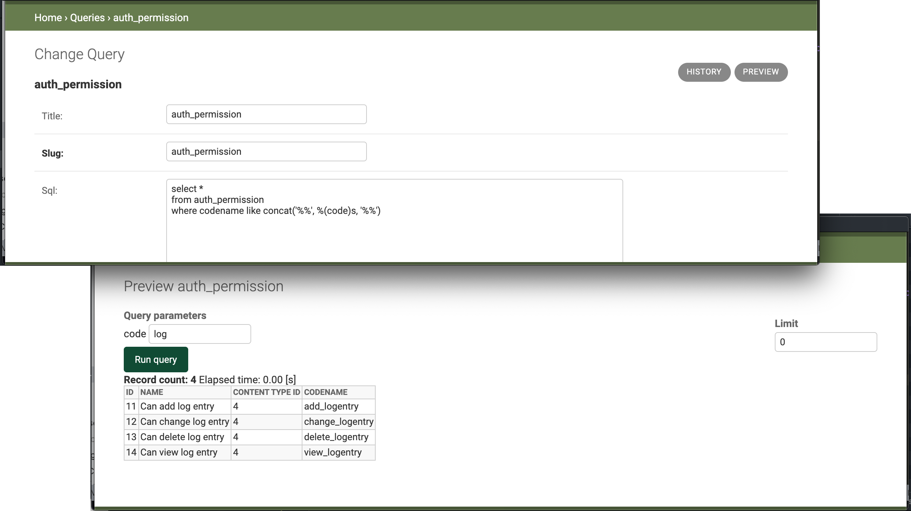
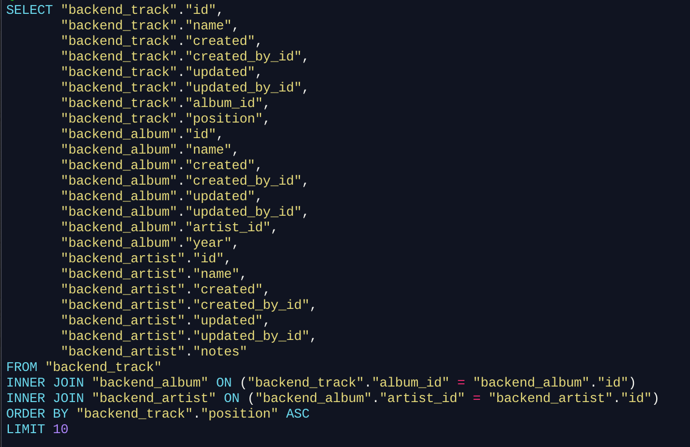
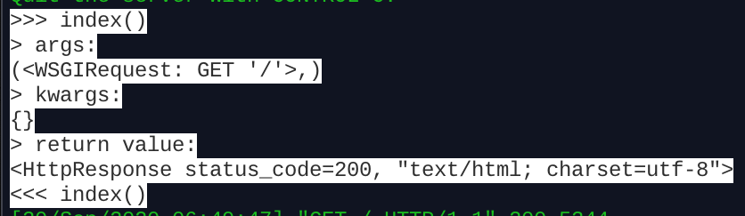
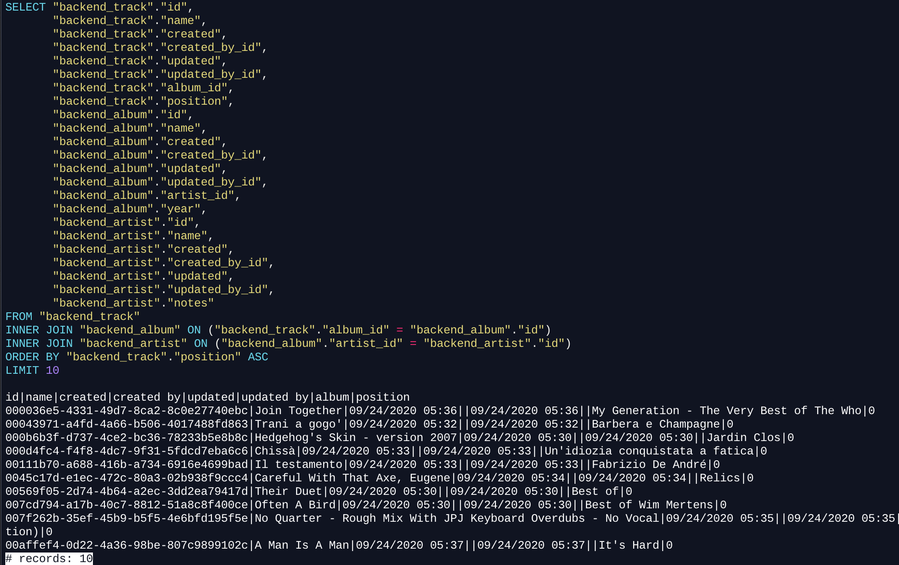

======================
django-query-inspector
======================

.. image:: https://badge.fury.io/py/django-query-inspector.svg
    :target: https://badge.fury.io/py/django-query-inspector

A collection of tools to:

    - count and trace db queries for debugging purposes or to optimize them
    - render a Queryset (or a list of dictionaries) in various formats
    - export a Queryset to a spreadsheet
    - inspect the SQL activity happening under the hood of a Django project
    - and more ...

.. contents::

.. sectnum::

Quick start
-----------

1. Installation::

    pip install django-query-inspector

2. Add "query_inspector" to your INSTALLED_APPS setting like this::

    INSTALLED_APPS = [
        ...
        'query_inspector',
    ]

3. Add "QueryCountMiddleware" to your MIDDLEWARE setting like this::

    MIDDLEWARE = [
        ...
        'query_inspector.middleware.QueryCountMiddleware',
    ]

4. Optionally, include styles in your base template::

    <link href="" rel="stylesheet" />

5. Optional dependencies:

    - sqlparse
    - termcolor
    - pygments
    - tabulate
    - xlsxwriter

Does it work?
-------------

Running the unit tests from your project::

    python manage.py test -v 2 query_inspector --settings=query_inspector.tests.test_settings

Running the unit tests from your local fork::

    cd django-query-inspector
    ./runtests.py

or::

    coverage run --source='.' runtests.py
    coverage report

Query counting
--------------

A middleware that prints DB query counts in Django's runserver console output (only in DEBUG mode).

Adapted from: `Django Querycount <https://github.com/bradmontgomery/django-querycount>`_

by Brad Montgomery

=========================== =============================================================================================
Setting                     Meaning
--------------------------- ---------------------------------------------------------------------------------------------
IGNORE_ALL_REQUESTS         Disables query count
IGNORE_REQUEST_PATTERNS     A list of regexp patterns to bypass matching requests
IGNORE_SQL_PATTERNS         A list of regexp patterns to bypass matching queries
THRESHOLDS                  How many queries are interpreted as high or medium (and the color-coded output)
DISPLAY_ALL                 Trace all queries (even when not duplicated)
DISPLAY_PRETTIFIED          Use pygments and sqlparse for queries tracing
COLOR_FORMATTER_STYLE       Color formatter style for Pygments
RESPONSE_HEADER             Custom response header that contains the total number of queries executed (None = disabled)
DISPLAY_DUPLICATES          Controls how the most common duplicate queries are displayed (None = displayed)
=========================== =============================================================================================

Default settings (to be overridden in projects' settings)::

    QUERYCOUNT = {
        'IGNORE_ALL_REQUESTS': True,
        'IGNORE_REQUEST_PATTERNS': [],
        'IGNORE_SQL_PATTERNS': [],
        'THRESHOLDS': {
            'MEDIUM': 50,
            'HIGH': 200,
            'MIN_TIME_TO_LOG': 0,
            'MIN_QUERY_COUNT_TO_LOG': 0
        },
        'DISPLAY_ALL': True,
        'DISPLAY_PRETTIFIED': True,
        'COLOR_FORMATTER_STYLE': 'monokai',
        'RESPONSE_HEADER': 'X-DjangoQueryCount-Count',
        'DISPLAY_DUPLICATES': 0,
    }

Execute SQL statements
----------------------

It is possible to execute a SQL statements against the default db connection using the following helper:

.. code:: python

    query_inspector.sql.perform_query(sql, params, log=False, validate=True)

The resulting recordset will be returned as a list of dictionaries.

Or, you can save it in the Django admin (model query_inspector.Query),
then click the "Preview" button.

If the query contains named parameters (such as `%(name)s`), a form will be displayed to collect the
actual values before execution.

Inspired by:

- `django-sql-dashboard <https://github.com/simonw/django-sql-dashboard>`_
- `django-sql-explorer <https://github.com/groveco/django-sql-explorer>`_

    query_preview

App settings
------------

::

    QUERY_INSPECTOR_QUERY_SUPERUSER_ONLY = True
    QUERY_INSPECTOR_QUERY_DEFAULT_LIMIT = 0
    QUERY_INSPECTOR_SQL_BLACKLIST = (
        'ALTER',
        'RENAME ',
        ...
    QUERY_INSPECTOR_SQL_WHITELIST = (
        'CREATED',
        'UPDATED',
        ...

@query_debugger
---------------

Decorator to check how many queries are executed when rendering a specific view.

Adapted from:

`Django select_related and prefetch_related: Checking how many queries reduce using these methods with an example <https://medium.com/better-programming/django-select-related-and-prefetch-related-f23043fd635d>`_

by Goutom Roy

Examples::

    from query_inspector import query_debugger

    @query_debugger
    def tracks_list_view(request):
        ...

    class TrackAjaxDatatableView(AjaxDatatableView):

        ...

        @query_debugger
        def dispatch(self, request, *args, **kwargs):
            ...

Result:

    query_debugger

Tracing queries in real-time
----------------------------

On rare occasions, you might want to trace queries immediately as they happen
while stepping through the code.

For that aim, configure the 'django.db.backends' logger in your settings;
to print formatted and colored queries, provided pygments and sqlparse have been
installed, use the **query_inspector.log.QueryLogHandler** handler::

    LOGGING = {
        'version': 1,
        'disable_existing_loggers': False,
        'handlers': {
            'db_console': {
                'level': 'DEBUG',
                #'class': 'logging.StreamHandler',
                'class': 'query_inspector.log.QueryLogHandler',
            },
        },
        'loggers': {
            'django.db.backends': {
                'handlers': ['db_console', ],
                'level': 'DEBUG',
            },
        },
    }

Inspecting queries in a unit test
---------------------------------

This is not obvious, since unit tests are run with DEBUG disabled.

Django provides a convenient **CaptureQueriesContext** for this:

.. code:: python

    import pprint
    from django import db
    from django.test.utils import CaptureQueriesContext
    from query_inspector import prettyprint_query

    def text_whatever(self):

        db.reset_queries()
        with CaptureQueriesContext(db.connection) as context:

            ... do your stuff ...

        num_queries = context.final_queries - context.initial_queries
        print('num_queries: %d' % num_queries)
        #pprint.pprint(context.captured_queries)

        for row in context.captured_queries:
            prettyprint_query(row['sql'])
            print('time: ' + row['time'])

More examples are available here:

`Python django.test.utils.CaptureQueriesContext() Examples <https://www.programcreek.com/python/example/74788/django.test.utils.CaptureQueriesContext>`_

Tracing
-------

Some helper functions are available to print formatted and colored text in the console.

Optional requirements:

    - sqlparse
    - termcolor
    - pygments
    - tabulate

Functions:

def trace(message, color='yellow', on_color=None, attrs=None, prompt='', prettify=False)
    Display 'message', optionally preceed by 'prompt';
    If 'prettify' is True, format message with pprint

    Color support provided by: https://pypi.org/project/termcolor/

def prettyprint_query(query, params=None, colorize=True, prettify=True, reindent=True)
    Display the specified SQL statement

def prettyprint_queryset(qs, colorize=True, prettify=True, reindent=True)
    Display the SQL statement implied by the given queryset

def trace_func(fn):
    Decorator to detect: function call, input parameters and return value

def qsdump( * fields, queryset, max_rows=None)
    See below

Results:

    prettyprint_queryset

    trace_func

Inspect a queryset with qsdump
------------------------------

With qsdump you can:

- display the formatted SQL statement
- display the content of the queryset

Parameters:

    fields:
        one or more field names; '*' means 'all'

    queryset:
        the queryset to be inspected

    max_rows:
        optionally limit the numer of rows

    render_with_tabulate=True
        use "tabulate" when available

    title=""
        optional title

Example::

    qsdump('*', queryset=tracks, max_rows=10)

|

    qsdump

Queryset rendering
------------------

A few templatetags are available to render either a queryset or a list of dictionaries::

    def render_queryset_as_table(* fields, queryset, options={})
    def render_queryset_as_csv(* fields, queryset, options={})
    def render_queryset_as_text(* fields, queryset, options={})

Sample usage::

    

    <link href="" rel="stylesheet" />

    <table class="simpletable smarttable">
        
    </table>

Parameters:

queryset: a queryset of a list of dictionaries with data to rendered

options:
    - max_rows: max n. of rows to be rendered (None=all)
    - format_date:  date formatting string; see:
        + https://docs.djangoproject.com/en/dev/ref/settings/#date-format
        + https://docs.djangoproject.com/en/dev/ref/templates/builtins/#date
    - add_totals: computes column totals and append results as bottom row
    - transpose: flag to transpose the resulting table

fields: a list of field specifiers, espressed as:
    - "fieldname", or
    - "fieldname|title", or
    - "fieldname|title|extra_classes"

    Field "extra classes" with special styles:
        - "percentage": render column as %
        - "enhanced"
        - "debug-only"

.. figure:: screenshots/render_queryset.png

    render_queryset

More templatetags::

    def pdb(element)
    def ipdb(element)
    def format_datetime(dt, include_time=True, include_seconds=False, exclude_date=False)
    def format_date(dt)
    def format_datetime_with_seconds(dt)
    def format_time(t, include_seconds=False)
    def format_time_with_seconds(t)
    def format_timedelta(td_object, include_seconds=True)
    def format_timediff(t1, t2, include_seconds=True)
    def timeformat_seconds(seconds)
    def timeformat(seconds)
    # def format_number(value, decimals, grouping )
    def queryset_as_json(qs)
    def object_as_dict(instance, fields=None, exclude=None)
    def object_as_json(instance, fields=None, exclude=None, indent=0)

Custom rendering
----------------

For greated control of the final rendering, you can retrieve headers and data rows separately (as lists)
using:

    def render_queryset_as_table(* fields, queryset, options={})

For example, the equivalent of:

.. code:: python

        print(render_queryset_as_text(*fields, queryset=queryset, options=options))

can be reproduced as follows:

.. code:: python

        headers, rows = render_queryset_as_data(*fields, queryset=queryset, options=options)

        print('|'.join(headers))
        for row in rows:
            print('|'.join(row))
        print("")

Transposing resulting table
---------------------------

Occasionally, you might need to switch columns and rows in the resulting table;
this can be obtained by adding a `'transpose': True` to the `options`.

Currently available for `render_queryset_as_data()` and `render_queryset_as_table()`.

Alternatively, you can transpose a queryset with `django-pandas` as follows:

.. code:: python

    import pandas as pd
    from django_pandas.io import read_frame

    df = read_frame(queryset)
    table_html = df.transpose().to_html()
    print(table_html)

Download the queryset as CSV or Excel file (xlsx)
-------------------------------------------------

For historical reasons, we provide two different approaches to export the queryset as a spreadsheet:

1) with the class SpreadsheetQuerysetExporter (see `Exporters`_ below)

2) parsing the queryset with the aid of `render_queryset_as_table`

The first requires a proper Queryset, while the second should work with either a Queryset
or a list of dictionares.

In both cases, two helper view functions are available to build the HTTP response
required for attachment download::

    export_any_queryset(request, queryset, filename, excluded_fields=[], included_fields=[], csv_field_delimiter = ";")

    export_any_dataset(request, *fields, queryset, filename, csv_field_delimiter = ";")

The helper function normalized_export_filename(title, extension) might be used
to build filenames consistently.

Sample usage:

.. code:: python

    from django.utils import timezone
    from query_inspector.views import normalized_export_filename
    from query_inspector.views import export_any_dataset

    def export_tracks_queryset(request, file_format='csv'):
        queryset = Track.objects.select_related('album', 'album__artist', )
        filename = normalized_export_filename('tracks', file_format)
        return export_any_queryset(
            request,
            queryset,
            filename,
            excluded_fields=[],
            included_fields=[],
            csv_field_delimiter = ";"
        )

    def export_tracks_dataset(request, file_format='csv'):
        queryset = Track.objects.select_related('album', 'album__artist', )
        filename = '%s_%s.%s' % (
            timezone.localtime().strftime('%Y-%m-%d_%H-%M-%S'),
            "tracks",
            file_format,
        )
        fields = [
            "id",
            "name|Track",
            "album|Album",
        ]

        return export_any_dataset(request, *fields, queryset=queryset, filename=filename)

then in your template:

.. code:: html

    

        

            <label>Export Tracks queryset:</label>
            <a href="/tracks/download_queryset/xlsx/" class="button">Download (Excel)</a>
            <a href="/tracks/download_queryset/csv/" class="button">Download (CSV)</a>
        

         
        

            <label>Export Tracks dataset:</label>
            <a href="/tracks/download_dataset/xlsx/" class="button">Download (Excel)</a>
            <a href="/tracks/download_dataset/csv/" class="button">Download (CSV)</a>
        

    

where:

.. code:: python

    urlpatterns = [
        ...
        path('tracks/download_queryset/csv/', views.export_tracks_queryset, {'file_format': 'csv', }),
        path('tracks/download_queryset/xlsx/', views.export_tracks_queryset, {'file_format': 'xlsx', }),
        path('tracks/download_dataset/csv/', views.export_tracks_dataset, {'file_format': 'csv', }),
        path('tracks/download_dataset/xlsx/', views.export_tracks_dataset, {'file_format': 'xlsx', }),
        ...
    ]

Generic helpers
---------------

def get_object_by_uuid_or_404(model, uuid_pk)

    Calls get_object_or_404(model, pk=uuid_pk)
    but also prevents "badly formed hexadecimal UUID string" unhandled exception

def prettify_json(data)

    Given a JSON string, returns it as a safe formatted HTML
    Sample usage in Model::

        def summary_prettified(self):
            return prettify_json(self.summary)

    then add it to the list of readonly_fields in the ModelAdmin

def cleanup_queryset(queryset)

    Remove multiple joins on the same table, if any

    WARNING: can alter the origin queryset order

Exporters
---------

class XslxFile(object)
    XSLX writer

    Requires: xlsxwriter

def open_xlsx_file(filepath, mode="rb")
    Utility to open an archive supporting the "with" statement

Sample usage::

    with open_xlsx_file(filepath) as writer:
        self.export_queryset(writer, fields, queryset)
    assert writer.is_closed()

class SpreadsheetQuerysetExporter(object)
    Helper class to export a queryset to a spreadsheet.

Sample usage::

    writer = csv.writer(output, delimiter=field_delimiter, quoting=csv.QUOTE_MINIMAL)
    exporter = SpreadsheetQuerysetExporter(writer, file_format='csv')
    exporter.export_queryset(
        queryset,
        included_fields=[
            'id',
            'description',
            'category__id',
            'created_by__id',
        ]
    )

See also: `Download the queryset as CSV or Excel file (xlsx)`_

Helper management commands
--------------------------

A few management commands are provided to:

    - quickly download database and/or media file from a remote project's instance
    - save/restore a backup copy of database and/or media files to/from a local backup folder

Database actions require Postrgresql; downloading from remote instance requires
read access via SSH.

You're advised to double-check implied actions by dry-running these commands
before proceeding.

**sitecopy: Syncs database and media files for local project from a remote instance**

Settings::

    REMOTE_HOST_DEFAULT = getattr(settings, 'SITECOPY_REMOTE_HOST_DEFAULT', '<REMOTE_HOST>')
    PROJECT = getattr(settings, 'SITECOPY_PROJECT', '<PROJECT>')
    SOURCE_MEDIA_FOLDER = getattr(settings, 'SITECOPY_SOURCE_MEDIA_FOLDER', '/home/%s/public/media/' % PROJECT)

Usage::

    usage: manage.py sitecopy [-h] [--dry-run] [--quiet] [--host HOST] [-v {0,1,2,3}] [--settings SETTINGS]

    Syncs database and media files for project "gallery" from remote server "gallery.brainstorm.it"

    optional arguments:
      -h, --help            show this help message and exit
      --dry-run, -d         Dry run (simulate actions)
      --quiet, -q           do not require user confirmation before executing commands
      --host HOST           Default: "gallery.brainstorm.it"
      -v {0,1,2,3}, --verbosity {0,1,2,3}
                            Verbosity level; 0=minimal output, 1=normal output, 2=verbose output, 3=very verbose output
      --settings SETTINGS   The Python path to a settings module, e.g. "myproject.settings.main". If this isn't provided, the
                            DJANGO_SETTINGS_MODULE environment variable will be used.

**dump_local_data: Dump local db and media for backup purposes (and optionally remove old backup files)**

Settings::

    DUMP_LOCAL_DATA_TARGET_FOLDER = getattr(settings, 'DUMP_LOCAL_DATA_TARGET_FOLDER', os.path.join(settings.BASE_DIR, '..', 'dumps', 'localhost'))

Usage::

    usage: manage.py dump_local_data [-h] [--target target] [--dry-run] [--max-age MAX_AGE] [--no-gzip] [--legacy]
                                     [-v {0,1,2,3}] [--settings SETTINGS]

    Dump local db and media for backup purposes (and optionally remove old backup files)

    optional arguments:
      -h, --help            show this help message and exit
      --target target, -t target
                            choices: db, media, all; default: db
      --dry-run, -d         Dry run (simulation)
      --max-age MAX_AGE, -m MAX_AGE
                            If > 0, remove backup files old "MAX_AGE days" or more
      --no-gzip             Do not compress result
      --legacy              use legacy Postgresql command syntax
      -v {0,1,2,3}, --verbosity {0,1,2,3}
                            Verbosity level; 0=minimal output, 1=normal output, 2=verbose output, 3=very verbose output
      --settings SETTINGS   The Python path to a settings module, e.g. "myproject.settings.main". If this isn't provided, the
                            DJANGO_SETTINGS_MODULE environment variable will be used.

**restore_from_local_data: Restore db and media from local backups**

Settings::

    DUMP_LOCAL_DATA_TARGET_FOLDER = getattr(settings, 'DUMP_LOCAL_DATA_TARGET_FOLDER', os.path.join(settings.BASE_DIR, '..', 'dumps', 'localhost'))

Usage::

    usage: manage.py restore_from_local_data [-h] [--target target] [--dry-run] [--no-gzip] [--source-subfolder SOURCE_SUBFOLDER]
                                             [-v {0,1,2,3}] [--settings SETTINGS]
                                             prefix

    Restore db and media from local backups; source folder is "/Volumes/VMS3/django_storage/gallery/dumps/localhost"

    positional arguments:
      prefix                Initial substring to match the filename to restore from; provide enough characters to match a single file

    optional arguments:
      -h, --help            show this help message and exit
      --target target, -t target
                            choices: db, media, all; default: db
      --dry-run, -d         Dry run (simulation)
      --no-gzip             Do not compress result
      --source-subfolder SOURCE_SUBFOLDER, -s SOURCE_SUBFOLDER
                            replaces "localhost" in DUMP_LOCAL_DATA_TARGET_FOLDER
      -v {0,1,2,3}, --verbosity {0,1,2,3}
                            Verbosity level; 0=minimal output, 1=normal output, 2=verbose output, 3=very verbose output
      --settings SETTINGS   The Python path to a settings module, e.g. "myproject.settings.main". If this isn't provided, the
                            DJANGO_SETTINGS_MODULE environment variable will be used.
